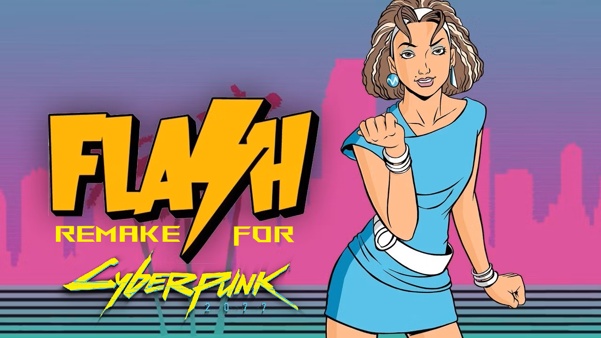

# Flash-FM-80.8-Remake-Cyberpunk-2077-Mod
Flash FM 80.8 remake made for cyberpunk 2077

This mod originally was featured on Nexus Mods, however due to a copyright violation on their website it was removed, however i worked on hard on this mod so i have uploaded it to internet archive to preserve it.

## Requirements:

to use this mod, you will need 3 dependencies we will include both of them below:

- [Cyber Engine Tweaks](https://www.nexusmods.com/cyberpunk2077/mods/107)
- [RadioExt](https://www.nexusmods.com/cyberpunk2077/mods/4591)
- [RED4ext](https://www.nexusmods.com/cyberpunk2077/mods/2380)

This mod can be installed via the Vortex Mod Manager or manually!

INSTRUCTIONS:
Copy both the archive and bin folder to the root of where Cyberpunk2077 is installed in!
